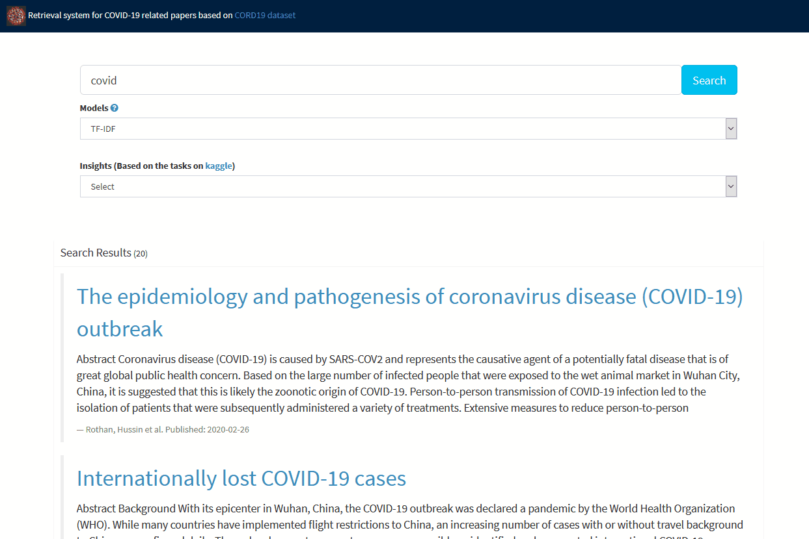

#   Covid19-search

<a href="/flairNLP/flair/blob/master/CONTRIBUTING.md"></a> <a href="https://opensource.org/licenses/MIT" rel="nofollow"></a>

This repository contains source code for searching covid-19 relevant papers based on the [COVID-19 Open Research Dataset (CORD-19)](https://pages.semanticscholar.org/coronavirus-research). The repository also provides a solution to the tasks in [COVID-19 Open Research Dataset Challenge on Kaggle (CORD-19)](https://www.kaggle.com/allen-institute-for-ai/CORD-19-research-challenge). Update: 2020-04-10.

### Features
- Support multiple bag-of-words models (count, tf-idf, bm25).
- Support semantic search models such as fasttext, glove.
- Enable to combine the aforementioned two types of models.
- Provide a live web application that can be customized models for end-users.


### Quick Start
```python
git clone https://github.com/wangcongcong123/covidsearch.git
cd covidsearch
pip install -e .
```
```python
from cord import *

# make sure put the paper collections (four .tar.gz files) and medataset csv file under the dataset_folder
dataset_folder = "dataset/"
# load metadata and full texts of papers
metadata = load_metadata_papers(dataset_folder, "metadata.csv")
full_papers = load_full_papers(dataset_folder)
# full_input_instances include title, abstract, body text
full_input_instances = [(id_, metadata[id_]["title"], metadata[id_]["abstract"], body) for id_, body in
                        full_papers.items() if id_ in metadata]
tfidf_model = FullTextModel(full_input_instances, weights=[3, 2, 1], vectorizer_type="tfidf")
query = "covid-19 transmission characteristics"
top_k = 10
start = time.time()
results = tfidf_model.query(query, top_k=top_k)
print("Query time: ", time.time() - start)
# around 0.3 s after re-run (the first time runs more time for object serilisation)
```

### [Examples](examples/)
- [Bag-of-words search](examples/full_text_run.py) # include count, tf-idf, and bm25 (examples/full_text_run.py).
- [Embedding-based search](examples/embedding_run.py) # include fasttext, glove (examples/embedding_run.py).
- [Model Combinations](examples/ensemble_run.py) # combination of the aforementioned two types (examples/ensemble_run.py).

- [Insights Extraction](examples/insight_extract.py) # this corresponds to tackle [the tasks in kaggle](https://www.kaggle.com/allen-institute-for-ai/CORD-19-research-challenge/tasks). (examples/ensemble_run.py).

Try to run ``python examples/ensemble_run.py`` where a pre-trained insights file is loaded and presented to you.

### Start as a web server

Here just demonstrating pre-trained insights as an example. For customisation (query search), have a hack on [app.py](app.py) and [templates/layout.html](templates/layout.html) to easily figure out. Make sure you download the [metadata.csv](https://ai2-semanticscholar-cord-19.s3-us-west-2.amazonaws.com/2020-04-03/metadata.csv) from CORD19 dataset and put it under ./dataset first, then enter:
```
python app.py
```
Go browser via http://127.0.0.1:5000, the web application is as follows.



### Server as service
- The server can also be requested in a cross-origin way.
- You set a GET/POST request to obtaining insights by task name.
- A GET request example is like this: ``http://127.0.0.1:5000/kaggle_task?task_name=task1``.
- A POST request example is like this: ``curl -i -X POST -H "Content-Type: application/json" -d "{\"task_name\":\"task1\"}" http://127.0.0.1:5000/kaggle_task``. 
- Adapt these to Ajax GET/POST request in your case where you want to embed it to your front-end web html pages!

### Contributions

Feedback and pull requrest are welcome for getting the project better off.
